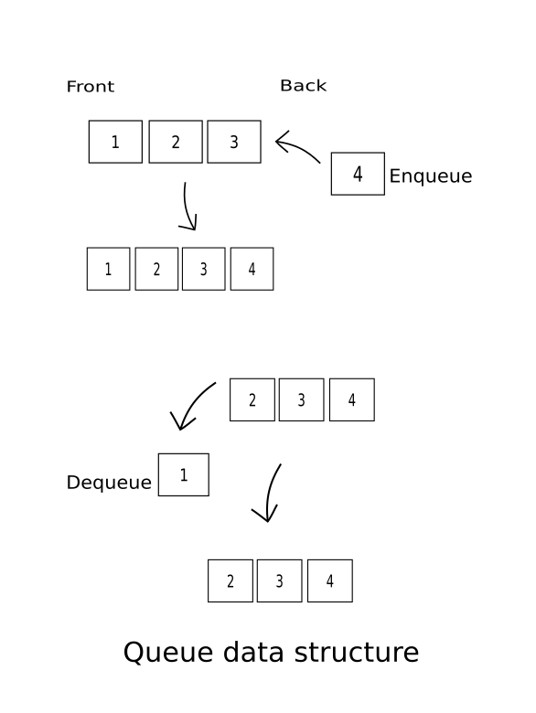
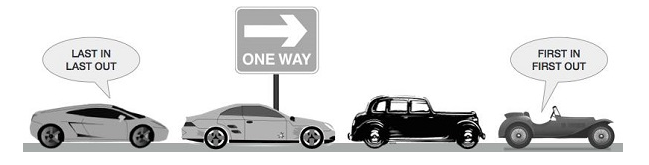

#Queue Exercise

#### About Queue - Basic Informations
> Queue is an abstract data structure, somewhat similar to Stacks. Unlike stacks, a queue is open at both its ends. 
> One end is always used to insert data (enqueue) and the other is used to remove data (dequeue). 
> Queue follows First-In-First-Out methodology, i.e., the data item stored first will be accessed first.

## Basic methods 
> _***Queue data structure***_
> 
>
>
> _***Queue real life example***_
> 
>
>
#### Basic methods description
> _***offer()***_
> Add (store) an item to the queue.
>
> _***remove()***_ 
> Remove (access) an item from the queue.
>
> _***peek()***_ 
> Gets the element at the front of the queue without removing it.
>
> _***isFull()***_ 
> Checks if the queue is full.
>
> _***element()***_ 
> Checks if the element exists.
>
> _***poll()***_ 
> Returns or delets the head (first) element.
>

#### Links
> [Usefull link about queue documentation](https://www.softwaretestinghelp.com/java-queue-interface/#:~:text=A%20queue%20is%20a%20linear,and%20removed%20from%20the%20front.)

